# ConcurQueue: Priority Task Dispatch System

A high-performance, multithreaded task dispatcher with priority handling, fault tolerance, and real-time monitoring. Perfect for simulating job queues with critical/non-critical task segregation.



---

## 📂 Folder Structure

```markdown
com.NovaTech.dispatcher/
├── dispatcher/
│ ├── DispatcherApp.java # Entry point
│ ├── model/
│ │ └── Task.java # Task entity (UUID, priority, etc.)
│ ├── producer/
│ │ └── Producer.java # Task generator threads
│ ├── consumer/
│ │ └── Consumer.java # Task processor threads
│ ├── repository/
│ │ └── TaskRepository.java # Thread-safe queue & status manager
│ ├── service/
│ │ └── MonitorService.java # Metrics & stuck task detector
│ ├── util/
│ │ └── JsonExporter.java # Task status JSON serializer
│ └── TaskStatus.java # Enum (SUBMITTED/PROCESSING/etc.)
├── src/main/resources/ # Config files (if any)
├── target/ # Build outputs
├── Banner.png # Project banner
├── task_status_export.json # Auto-generated status report
└── README.md # This file
```

## 🚀 Key Features
- **Priority-Based Processing**: Tasks (priority 1-10) processed in order of importance
- **Multi-Threaded Architecture**:
    - 3 Producer threads generating tasks
    - 5 Consumer threads with thread-safe processing
- **Fault Tolerance**:
    - Automatic retries (up to 3x) for failed tasks
    - Stuck task detection (30s timeout)
- **Real-Time Monitoring**:
    - Live queue metrics (size, active workers)
    - JSON status exports every minute
- **Graceful Shutdown**: Safely drains queue and logs totals on termination

---

## Core Components
- Task: UUID, name, priority (implements Comparable)
- TaskRepository: Manages PriorityBlockingQueue + ConcurrentHashMap for status
- MonitorService: Logs metrics + exports to task_status_export.json

## ⚙️ Setup & Dependencies
- **Requirements:**
  - Java 17+
  - Lombok (@Data annotations)
  - Jackson (JSON export)

- **Build:**
  - mvn clean install

## 🏃‍♀️ Running the system
 ```bash
 # Run with default config (3 producers, 5 consumers)
java -jar target/dispatcher.jar

# Expected Output:
[Producer-1] produced task: Task-473 (Priority: 10)
[Consumer-2][14:30:45] Processing Task-473 (Priority: 10)
[Monitor] Queue: 2 tasks | Active workers: 3 | Completed: 17
```

## 📄 Sample JSON Export
```json
[
  {
    "taskId": "3fa85f64-5717-4562-b3fc-2c963f66afa6",
    "taskName": "Task-473",
    "priority": 10,
    "status": "COMPLETED"
  }
]
```